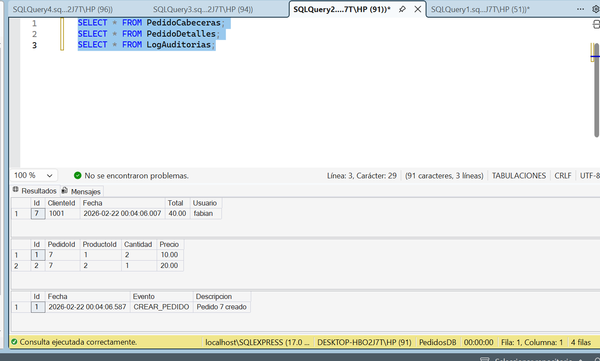

# API de Registro de Pedidos

API REST desarrollada en ASP.NET Core para el registro transaccional de pedidos,
como parte de una prueba técnica.

---

## Descripción

El sistema permite registrar pedidos de clientes, almacenando información
de cabecera, detalle y auditoría, garantizando consistencia mediante transacciones.

Antes de confirmar un pedido, se valida el cliente mediante un servicio externo.

---

## Arquitectura

El proyecto está organizado por capas:

- Controllers
- Services
- Data
- Models
- DTOs

---

## Tecnologías

- ASP.NET Core (.NET 10)
- Entity Framework Core
- SQL Server Express
- Swagger (OpenAPI)
- Git

---

## Requisitos

- Visual Studio 2026
- .NET SDK 10
- SQL Server Express
- SQL Server Management Studio

---

## Base de Datos

Ejecutar el archivo `database.sql` en SQL Server para crear la base de datos:
Este archivo está en la raíz del proyecto

- PedidoCabeceras
- PedidoDetalles
- LogAuditorias

---

## Configuración

Editar el archivo `appsettings.json`:

```json
"ConnectionStrings": {
  "Default": "Server=localhost\\SQLEXPRESS;Database=PedidosDB;Trusted_Connection=True;TrustServerCertificate=True;"
}

---

## Guía: Clonar el Repositorio

Esta sección describe todos los pasos necesarios para descargar, configurar
y ejecutar el proyecto localmente.

---

### 1. Clonar el Repositorio

Clonar el proyecto desde GitHub:

```bash
git clone https://github.com/FabianGM/ApiPedidosMaresa.git

### Ingresar a la carpeta del proyecto:

cd ApiPedidosMaresa
## Ejecución del Proyecto

---

### 2. Abrir el Proyecto en Visual Studio

1. Abrir Visual Studio 2026.
2. Seleccionar **Open a project or solution**.
3. Abrir el archivo:

```text
PedidosAPI.sln
```

4. Esperar a que cargue completamente.

---

### 3. Configurar la Base de Datos

1. Abrir SQL Server Management Studio.
2. Conectarse a:

```text
localhost\SQLEXPRESS
```

3. Abrir el archivo `database.sql`.
4. Ejecutar el script completo.
5. Verificar que se haya creado la base de datos `PedidosDB`.

---

### 4. Configurar la Cadena de Conexión

Abrir el archivo `appsettings.json` y verificar:

```json
"ConnectionStrings": {
  "Default": "Server=localhost\\SQLEXPRESS;Database=PedidosDB;Trusted_Connection=True;TrustServerCertificate=True;"
}
```

---

### 5. Restaurar Dependencias

Si Visual Studio no restaura automáticamente los paquetes, ejecutar:

```bash
dotnet restore
```
o con clic derecho en la solución y restaurar

---

### 6. Ejecutar el Proyecto

1. Seleccionar el perfil `https` o mejor IISExpress.
2. Presionar `F5` o el botón **Run**.
3. Esperar a que inicie el servidor local.

En la consola debe aparecer algo similar a:

```text
Now listening on: https://localhost:XXXX
```

---

### 7. Acceder a Swagger

Abrir el navegador y acceder a:

```text
https://localhost:XXXX/swagger
```

Ejemplo:

```text
https://localhost:44393/swagger
```

---

### 8. Probar el Endpoint Principal

1. Ingresar a Swagger.
2. Seleccionar `POST /api/pedidos`.
3. Presionar **Try it out**.
4. Ingresar el siguiente JSON:

```json
{
  "clienteId": 1001,
  "usuario": "fabian",
  "items": [
    { "productoId": 1, "cantidad": 2, "precio": 10 },
    { "productoId": 2, "cantidad": 1, "precio": 20 }
  ]
}
```

5. Presionar **Execute**.
6. Verificar que la respuesta sea `200 OK`.

---

## Evidencias de Funcionamiento

### Swagger en Ejecución
### Ejecución Exitosa del Endpoint


---

### Registros en Base de Datos

